import { Aside, LinkCard, CardGrid, Card } from '@astrojs/starlight/components';

Designing your anycast architecture before deployment saves time and prevents costly mistakes. This page covers common patterns, from simple two-node setups to globally distributed networks.

{/* TODO: Introduction emphasizing the importance of planning before implementation */}

## Basic Anycast Topology

The simplest anycast deployment consists of two or more nodes announcing the same prefix from different locations.

### Minimum Viable Anycast

A two-node setup provides basic redundancy and geographic distribution:

```mermaid
architecture-beta
    group region1(carbon:location)[Region 1]
    
    service server1(carbon:router)[Router] in region1
    service app1(server)[Anycast Node] in region1
    
    group region2(carbon:location)[Region 2]
    
    service server2(carbon:router)[Router] in region2
    service app2(server)[Anycast Node] in region2
    
    service internet(carbon:cloud)[Internet]

    junction junction1
    junction junction2

    app1:R -- L:server1
    app2:R -- L:server2
    server1:R -- L:junction1
    server2:R -- L:junction2
    junction1:T -- B:internet
    junction2:B -- T:internet
```

This topology includes two anycast nodes in separate regions, each connected to their local router, which in turn connects to the internet.

If a node goes offline, BGP will automatically reroute traffic to the remaining node, providing basic failover capability.

```mermaid
architecture-beta
    group region1(carbon:location)[Region 1]
    
    service server1(carbon:router)[Router] in region1
    service app1(server)[Anycast Node] in region1
    
    group region2(carbon:location)[Region 2]
    
    service server2(carbon:router)[Router] in region2
    service app2(server)[Anycast Node] in region2

    service internet(carbon:cloud)[Internet]

    %% junction junction1
    %% junction junction2

    app1:R -- L:server1
    app2:R -- L:server2
    server1:R -- L:internet
    %% server2:R -- L:junction2
    %% junction1:T -- B:internet
    %% junction2:B -- T:internet
```

Traffic destined for the anycast prefix will now be routed solely to the remaining active node.

<Aside type="tip">
  Start with two nodes in different regions to validate your configuration before expanding. This approach minimizes complexity while proving your setup works.
</Aside>

### Core Components

Every anycast node requires these components:

- **BGP Daemon**: Software like BIRD or FRR to handle BGP announcements and sessions.
- **Service Software**: The application or service you're anycasting (e.g., DNS server).
- **Health Checks**: Mechanisms to monitor service health and withdraw BGP announcements if a node fails.
- **Monitoring**: Tools to track BGP propagation, latency, and overall network health.

### Health Checking and Failover

Automatic failover requires health checks that withdraw BGP announcements when services fail:

- **Local Health Checks**: Monitor the service locally (e.g., DNS query success) and trigger BGP withdrawal if unhealthy.
- **BGP Withdrawal**: Configure your BGP daemon to withdraw the prefix when health checks fail.
- **Out-of-Band Monitoring**: Use external monitoring services to alert you of node failures.

## Multi-Region Deployment

Scaling beyond two nodes requires careful planning to ensure optimal traffic distribution.

### Geographic Placement Strategy

Choosing node locations involves balancing coverage, cost, and connectivity:

- **User Distribution**: Place nodes near your user base to minimize latency.
- **IXP Presence**: Deploy at Internet Exchange Points (IXPs) for better peering opportunities.
- **Transit Costs**: Consider the cost of transit in different regions; some areas may have higher fees.

### Regional Considerations

Different regions have unique characteristics affecting anycast performance:

- **Network Topology**: Understand the local internet topology to optimize routing.
- **Peering Policies**: Research common peering arrangements in each region. Generally, peering is more common in North America and Europe than in other areas.

<Aside type="note">
  Traffic doesn't always route to the geographically closest node. BGP path selection considers AS path length and routing policy, which may differ from physical distance.
</Aside>

### Scaling Patterns

A big pro of anycast is its ease of horizontal scaling. Compared to unicast, you can directly add more nodes to improve capacity and coverage, unlike with unicast, where you often need to upgrade existing infrastructure.

Common scaling patterns include:
- **Flat Model**: All nodes are equal peers announcing the same prefix. Simple but can lead to suboptimal routing in large deployments.
- **Regional Hubs**: Group nodes into regional clusters, each announcing a sub-prefix.
- **Tiered Architecture**: Use a combination of global and regional anycast prefixes to optimize routing and load distribution.

## DNS Anycast Architecture

DNS is the most common anycast application. Here's how to architect DNS-specific deployments:

### Authoritative DNS Anycast

Running your own authoritative DNS servers with anycast:

Authoritative DNS servers respond to queries for domains they manage. Anycast improves performance and resilience by distributing these servers globally. The zonefile should be synchronized across all nodes to ensure consistency. A common way to achieve this is by using IXFR/AXFR transfers or configuration management tools. When using IXFR/AXFR, ensure you properly set up TSIG so an unwanted adversary does not update your zones. IXFR is defined in RFC 1995 and AXFR in RFC 5936.

<Aside type="caution">
  Ensure all authoritative DNS nodes have identical zone data to prevent inconsistent responses. Use secure zone transfer methods to synchronize data.
</Aside>

### Recursive DNS Anycast

Anycast recursive resolvers require additional considerations:

{/* TODO: Cover cache coherency, DNSSEC validation, and resolver-specific challenges */}

<Aside type="caution">
  Recursive DNS anycast can experience cache inconsistency if traffic shifts between nodes. Consider this when designing your resolver architecture.
</Aside>

### DNS Software Choices

Popular DNS server software for anycast deployments:

{/* TODO: Brief comparison of BIND, Knot, PowerDNS for anycast use cases */}

## Choosing Your Stack

Your routing software choice affects configuration, features, and troubleshooting approaches.

### BIRD Internet Routing Daemon

BIRD is popular in the hobbyist community for its flexibility and active development:

**Strengths:**
- Lightweight and efficient
- Powerful filtering language
- Excellent documentation
- Active community support

{/* TODO: Expand on BIRD advantages, configuration style, and ideal use cases */}

### FRRouting (FRR)

FRR offers a Cisco-like CLI familiar to network engineers:

**Strengths:**
- Cisco-style configuration
- Multi-protocol support
- Enterprise feature set
- Strong community backing

{/* TODO: Expand on FRR advantages, configuration style, and ideal use cases */}

### Quick Comparison

| Aspect | BIRD | FRR |
|--------|------|-----|
| Configuration | Custom syntax | Cisco-like CLI |
| Learning curve | Moderate | Lower for Cisco users |
| Resource usage | Very light | Light |
| Community | Hobbyist-focused | Enterprise + hobbyist |

{/* TODO: Expand comparison with more specific details */}

<Aside type="tip">
  Both BIRD and FRR are excellent choices. If you have Cisco experience, FRR may feel more familiar. Otherwise, BIRD's configuration flexibility is often preferred by hobbyists.
</Aside>

## Planning Your Architecture

Before deploying, document your architecture decisions:

### Architecture Checklist

Use this checklist to plan your deployment:

{/* TODO: Comprehensive checklist covering topology, software choices, failover strategy, monitoring approach */}

### Diagramming Your Network

Create clear documentation of your planned architecture:

{/* TODO: Recommendations for diagramming tools and what to include in network diagrams */}

## Next Steps

With your architecture planned, you're ready to start configuring your routing software.

<CardGrid>
  <LinkCard
    title="BIRD Setup Guide"
    description="Step-by-step configuration guide for the BIRD routing daemon."
    href="/guides/bird-setup/"
  />
  <LinkCard
    title="FRR Setup Guide"
    description="Configure FRRouting for your anycast deployment."
    href="/guides/frr-setup/"
  />
</CardGrid>

Need to acquire resources first? Return to the prerequisites:

<LinkCard
  title="Getting Your ASN"
  description="Guide to acquiring an Autonomous System Number."
  href="/resources/getting-asn/"
/>
