import { Aside, LinkCard, CardGrid, Card } from '@astrojs/starlight/components';

Designing your anycast architecture before deployment saves time and prevents costly mistakes. This page covers common patterns, from simple two-node setups to globally distributed networks.

{/* TODO: Introduction emphasizing the importance of planning before implementation */}

## Basic Anycast Topology

The simplest anycast deployment consists of two or more nodes announcing the same prefix from different locations.

### Minimum Viable Anycast

A two-node setup provides basic redundancy and geographic distribution:

```mermaid
architecture-beta
    group region1(carbon:location)[Region 1]
    service server(carbon:router)[Router] in region1


```

{/* TODO: Diagram description and explanation of minimal topology */}

{/* TODO: Explain what happens during node failure and traffic redistribution */}

<Aside type="tip">
  Start with two nodes in different regions to validate your configuration before expanding. This approach minimizes complexity while proving your setup works.
</Aside>

### Core Components

Every anycast node requires these components:

{/* TODO: List and explain: BGP daemon, service software, health checks, monitoring */}

### Health Checking and Failover

Automatic failover requires health checks that withdraw BGP announcements when services fail:

{/* TODO: Explain health check mechanisms and BGP withdrawal strategies */}

## Multi-Region Deployment

Scaling beyond two nodes requires careful planning to ensure optimal traffic distribution.

### Geographic Placement Strategy

Choosing node locations involves balancing coverage, cost, and connectivity:

{/* TODO: Discuss placement considerations: user distribution, IXP availability, transit costs */}

### Regional Considerations

Different regions have unique characteristics affecting anycast performance:

{/* TODO: Cover regional differences in peering, transit costs, and routing behavior */}

<Aside type="note">
  Traffic doesn't always route to the geographically closest node. BGP path selection considers AS path length and routing policy, which may differ from physical distance.
</Aside>

### Scaling Patterns

Common approaches for growing your anycast network:

{/* TODO: Discuss horizontal scaling, regional hub models, and tier considerations */}

## DNS Anycast Architecture

DNS is the most common anycast application. Here's how to architect DNS-specific deployments:

### Authoritative DNS Anycast

Running your own authoritative DNS servers with anycast:

{/* TODO: Explain authoritative DNS anycast topology, zone synchronization, and consistency considerations */}

### Recursive DNS Anycast

Anycast recursive resolvers require additional considerations:

{/* TODO: Cover cache coherency, DNSSEC validation, and resolver-specific challenges */}

<Aside type="caution">
  Recursive DNS anycast can experience cache inconsistency if traffic shifts between nodes. Consider this when designing your resolver architecture.
</Aside>

### DNS Software Choices

Popular DNS server software for anycast deployments:

{/* TODO: Brief comparison of BIND, Knot, PowerDNS for anycast use cases */}

## Choosing Your Stack

Your routing software choice affects configuration, features, and troubleshooting approaches.

### BIRD Internet Routing Daemon

BIRD is popular in the hobbyist community for its flexibility and active development:

**Strengths:**
- Lightweight and efficient
- Powerful filtering language
- Excellent documentation
- Active community support

{/* TODO: Expand on BIRD advantages, configuration style, and ideal use cases */}

### FRRouting (FRR)

FRR offers a Cisco-like CLI familiar to network engineers:

**Strengths:**
- Cisco-style configuration
- Multi-protocol support
- Enterprise feature set
- Strong community backing

{/* TODO: Expand on FRR advantages, configuration style, and ideal use cases */}

### Quick Comparison

| Aspect | BIRD | FRR |
|--------|------|-----|
| Configuration | Custom syntax | Cisco-like CLI |
| Learning curve | Moderate | Lower for Cisco users |
| Resource usage | Very light | Light |
| Community | Hobbyist-focused | Enterprise + hobbyist |

{/* TODO: Expand comparison with more specific details */}

<Aside type="tip">
  Both BIRD and FRR are excellent choices. If you have Cisco experience, FRR may feel more familiar. Otherwise, BIRD's configuration flexibility is often preferred by hobbyists.
</Aside>

## Planning Your Architecture

Before deploying, document your architecture decisions:

### Architecture Checklist

Use this checklist to plan your deployment:

{/* TODO: Comprehensive checklist covering topology, software choices, failover strategy, monitoring approach */}

### Diagramming Your Network

Create clear documentation of your planned architecture:

{/* TODO: Recommendations for diagramming tools and what to include in network diagrams */}

## Next Steps

With your architecture planned, you're ready to start configuring your routing software.

<CardGrid>
  <LinkCard
    title="BIRD Setup Guide"
    description="Step-by-step configuration guide for the BIRD routing daemon."
    href="/guides/bird-setup/"
  />
  <LinkCard
    title="FRR Setup Guide"
    description="Configure FRRouting for your anycast deployment."
    href="/guides/frr-setup/"
  />
</CardGrid>

Need to acquire resources first? Return to the prerequisites:

<LinkCard
  title="Getting Your ASN"
  description="Guide to acquiring an Autonomous System Number."
  href="/resources/getting-asn/"
/>
